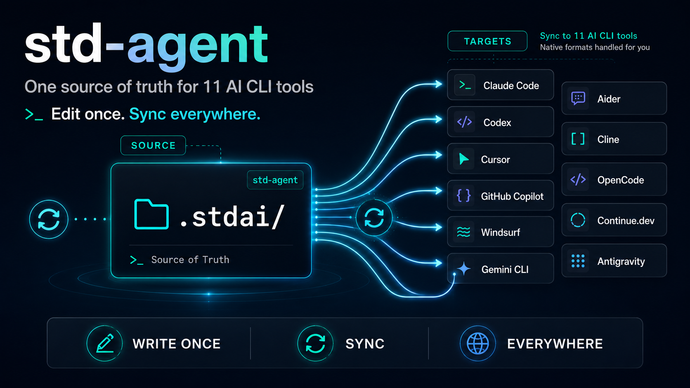

# std-agent



[](https://go.dev/)
[](LICENSE)
[](https://github.com/StringKe/std-ai/actions/workflows/ci.yml)

[English](README.md) | [简体中文](README.zh-CN.md) | [繁體中文](README.zh-TW.md) | [日本語](README.ja.md) | [한국어](README.ko.md) | **Русский** | [Français](README.fr.md) | [Deutsch](README.de.md) | [Español](README.es.md) | [Português](README.pt-BR.md)

---

`stdagent` — это лёгкий CLI на чистом Go. Он хранит одну директорию `.stdai/` как единый источник истины для AI-конфигурации проекта, а затем раскладывает её по **11 AI CLI инструментам**, беря на себя все нативные форматы, диалекты frontmatter и особенности каждого инструмента.

Перестаньте вручную поддерживать `CLAUDE.md`, `AGENTS.md`, `GEMINI.md`, `.cursor/rules/`, `.windsurf/rules/`, `.clinerules/`, `.github/copilot-instructions.md`. Пишите один раз — синхронизируется везде.

## Почему std-agent?

- **Единый источник** — пишите `rules` / `skills` / `commands` / `references` один раз в YAML frontmatter + Markdown.
- **Одиннадцать целей** — Claude Code, Codex, Cursor, GitHub Copilot, Windsurf, Gemini CLI, Aider, Cline, OpenCode, Continue.dev, Antigravity.
- **Без вендор-лока** — writer трогает только белый список путей; перед каждой синхронизацией делается бэкап; `clean` откатывает всё.
- **Обнаружение дрифта** — `status` показывает файлы, изменённые вне stdagent; `fix` восстанавливает их.
- **MCP** — один `.stdai/standards/mcp.json` раскладывается в `.mcp.json` / `.cursor/mcp.json` / `.vscode/mcp.json`.
- **Поддержка monorepo** — поиск конфига идёт вверх от `cwd`; работает из любой поддиректории.
- **Самообновление** — `stdagent upgrade` тянет подписанные релизы с GitHub с проверкой sha256 и атомарной заменой.

## Поддерживаемые инструменты

### Tier 1 (9)

| Цель | Основные выходы |
|---|---|
| Claude Code (Anthropic) | `CLAUDE.md` + `.claude/{rules,skills,commands}/` + `.mcp.json` |
| Codex (OpenAI) | `AGENTS.md` + `.agents/skills/` + `.codex/rules/` (spillover по байтам) |
| Cursor | `.cursor/{rules/*.mdc,skills,commands}/` + `.cursor/mcp.json` |
| GitHub Copilot | `.github/{copilot-instructions,instructions,prompts,agents}/` + `.vscode/mcp.json` |
| Windsurf (Codeium) | `.windsurf/{rules,skills,workflows}/` |
| Gemini CLI (Google) | `GEMINI.md` + `.gemini/commands/*.toml` |
| Aider | переиспользует `AGENTS.md` (noop) |
| Cline | `.clinerules/` + `.clinerules/workflows/` |
| OpenCode | `.opencode/{agents,commands}/` |

### Tier 2 (2)

| Цель | Основные выходы |
|---|---|
| Continue.dev | `.continue/{rules,prompts}/` |
| Antigravity (Google) | `.agents/{rules,workflows}/` |

Каждая интеграция описана в [docs/targets/](docs/targets/).

## Быстрый старт

```bash
# Установка (macOS / Linux)
curl -fsSL https://raw.githubusercontent.com/StringKe/std-ai/main/install.sh | sh

# Установка (Windows PowerShell)
irm https://raw.githubusercontent.com/StringKe/std-ai/main/install.ps1 | iex

# Инициализация в проекте
cd your-project
stdagent init

# Отредактируйте .stdai/standards/rules/example.md и синхронизируйте на все активные цели
stdagent sync

# Проверка / исправление дрифта
stdagent status
stdagent fix
```

## Миграция существующего проекта на std-ai

В проекте уже разбросаны `CLAUDE.md` / `AGENTS.md` / `.cursor/rules/` / `.clinerules/` / `.github/copilot-instructions.md`? Вставьте промпт ниже в Claude Code / Codex / Cursor / Gemini CLI, и он переорганизует всё в структуру `.stdai/standards/`.

````text
Помоги мигрировать этот проект с разрозненной AI-конфигурации на std-agent. Сделай следующее:

1. С помощью Glob / Read просканируй все существующие файлы AI-правил:
   - Корень: CLAUDE.md AGENTS.md GEMINI.md .cursorrules .windsurfrules .clinerules
   - Подкаталоги: .claude/rules/ .claude/skills/ .claude/commands/ .claude/agents/
              .cursor/rules/ .windsurf/rules/ .clinerules/ .continue/rules/
              .github/copilot-instructions.md .github/instructions/
              .rulesync/rules/ .codex/AGENTS.md
   - Вложенные CLAUDE.md внутри репо (find . -name CLAUDE.md -not -path './.stdai/*')

2. Сообщи инвентарь: X rules / Y skills / Z commands / N вложенных CLAUDE.md,
   и отметь файлы с "обзором проекта".

3. Предложи план разбиения, дождись моего одобрения, затем пиши файлы:
   - Обзор проекта (определение / стек / железные правила / процесс поддержки)
     -> .stdai/standards/root.md
   - Каждое сфокусированное правило -> .stdai/standards/rules/<kebab-name>.md
   - Skill-пакет -> .stdai/standards/skills/<name>/SKILL.md (с подкаталогами scripts/ references/)
   - Слэш-команды -> .stdai/standards/commands/<name>.md
   - Вложенный CLAUDE.md -> .stdai/standards/nested/<относительный-путь>/root.md
   - В каждый файл добавляй frontmatter: type / name / description / priority / applyTo

4. Никакого "рефакторинга" оригинала. Сохраняй все исполняемые команды, API-эндпоинты,
   строки ошибок, пути файлов, номера строк. Разрешённые "оптимизации": убрать слова-связки,
   объединить дубликаты, разбить слишком большие файлы, переименовать устаревшие инструменты.

5. По завершении сообщи мне выполнить `stdagent sync` и удалить устаревшие артефакты
   (.rulesync/, .cursorrules одиночные и т.п.). НЕ удаляй файлы, которые stdagent сам
   производит (CLAUDE.md / AGENTS.md / .claude/rules/).

Полная спецификация (таблица полей frontmatter, шаблон root.md, схема вложенности,
маппинг миграции rulesync) — в выводе команды `stdagent intro`.
````

Также можно направить вывод сразу в LLM CLI:

```bash
stdagent intro | pbcopy            # macOS: скопировать в буфер и вставить в AI-чат
stdagent intro --json              # для агентов / автоматизации
```

## Команды

| Команда | Назначение |
|---|---|
| `stdagent init` | Создать `.stdai/` + `config.toml` + `.stdaiignore` + примеры standards |
| `stdagent pull` | Обновить git-источники, кэшируемые в `.stdai/cache/` |
| `stdagent sync` | Основное: pull → parse → convert → fan out |
| `stdagent fix` | Пересинхронизация для исправления дрифта (alias `sync`) |
| `stdagent status` | Дрифт и время последней синхронизации по каждой цели |
| `stdagent clean` | Удалить сгенерированные файлы (сохранив `.stdai/`) |
| `stdagent budget` | Проверка бюджета LLM-контекста (символы + оценка токенов) |
| `stdagent which <path>` | Список rules / references, применимых к файлу (контекст по требованию для AI) |
| `stdagent intro` | Печатает промпт для LLM-миграции существующей конфигурации |
| `stdagent upgrade` | Самообновление с GitHub Releases (sha256 + атомарная замена) |
| `stdagent version` | Информация о сборке |

Каждая команда поддерживает `--help`. Полная справка: [docs/commands.md](docs/commands.md).

## Формат исходных файлов

Полная схема — в [docs/spec.md](docs/spec.md) Part 1. Минимальный вид:

```markdown
---
type: rules                       # rules | skills | commands | references
name: coding-style
description: Общий стиль кода
priority: high                    # high | normal | low
targets: [claude-code, codex]     # явное включение (или exclude_targets для исключения)
applyTo: ["**/*.go"]
alwaysApply: false
---

# Coding Style

Always use meaningful variable names...
```

MCP-серверы (`.stdai/standards/mcp.json`):

```json
{
  "version": "1.0",
  "servers": {
    "github": { "type": "stdio", "command": "gh", "args": ["api"] },
    "linear": { "type": "http", "url": "https://mcp.linear.app/sse" }
  }
}
```

## Конфигурация

`.stdai/config.toml`:

```toml
version = "1.0"
inject = true            # вставлять footer "Generated by stdagent" в выходные файлы
inject_whatis = true     # добавлять однострочный комментарий о происхождении внутри skills
auto_pull = true         # автоматически pull git-источники при каждом sync
backup = true
backup_keep = 5

[targets]
claude-code  = { enabled = true,  convert = true }
codex        = { enabled = true,  convert = true }
cursor       = { enabled = false, convert = true }
copilot      = { enabled = false, convert = true }
windsurf     = { enabled = false, convert = true }
gemini       = { enabled = false, convert = true }
aider        = { enabled = false, convert = true }
cline        = { enabled = false, convert = true }
opencode     = { enabled = false, convert = true }
continue-dev = { enabled = false, convert = true }
antigravity  = { enabled = false, convert = true }

[sources.default]
url     = "https://github.com/your-org/ai-standards.git"
branch  = "main"
enabled = true
paths   = ["standards/"]
```

Полная справка: [docs/config-spec.md](docs/config-spec.md).

## Структура проекта

```
your-project/
├── .stdai/                    Внутренняя область (единый источник истины)
│   ├── config.toml            Единственный файл конфигурации
│   ├── standards/             Корень редактирования
│   │   ├── rules/
│   │   ├── skills/
│   │   ├── commands/
│   │   ├── references/
│   │   └── mcp.json           MCP-серверы (опционально)
│   ├── cache/                 Кэш git-источников
│   ├── backups/               Автоснимки перед каждым sync
│   └── state.json             Рантайм-состояние
├── .stdaiignore               gitignore-glob для исключения исходных файлов
├── CLAUDE.md                  Раскладка: Claude Code
├── AGENTS.md                  Раскладка: Codex / Cursor fallback / Copilot agent / OpenCode / Antigravity
├── GEMINI.md                  Раскладка: Gemini CLI
├── .mcp.json                  MCP для Claude
└── .claude/ .codex/ .cursor/ .github/ .windsurf/ .gemini/ .clinerules/ .opencode/ .continue/ .agents/
```

Подробности: [docs/file-structure.md](docs/file-structure.md).

## Поддержка monorepo

Если `--config` не указан, `stdagent` идёт вверх от `cwd` к ближайшему `.stdai/config.toml`. Запускайте из любой поддиректории — корень монорепо будет найден автоматически.

## Разработка

```bash
# Тулчейн (mise + go + golangci-lint + gofumpt + git-cliff)
mise install

# Частые задачи
mise run fmt        # gofumpt + goimports
mise run lint       # golangci-lint
mise run test       # go test -race -cover
mise run check      # fmt + lint + test в одну команду
mise run build      # собирает bin/stdagent
mise run run        # go run ./cmd/stdagent
```

## Документация

- **[docs/spec.md](docs/spec.md)** — полная спецификация: стандарт std-ai + различия 11 инструментов + стратегия конвертации
- [docs/prd.md](docs/prd.md) — требования к продукту
- [docs/architecture.md](docs/architecture.md) — модульная структура и потоки данных
- [docs/commands.md](docs/commands.md) — справочник CLI
- [docs/conversion-rules.md](docs/conversion-rules.md) — матрица конвертаций + маппинг frontmatter
- [docs/format-spec.md](docs/format-spec.md) — детальная схема frontmatter
- [docs/file-structure.md](docs/file-structure.md) — соглашения о структуре директорий
- [docs/roadmap.md](docs/roadmap.md) — дорожная карта
- [docs/targets/](docs/targets/) — заметки исследования по каждому из 11 инструментов

## License

MIT — см. [LICENSE](LICENSE).
